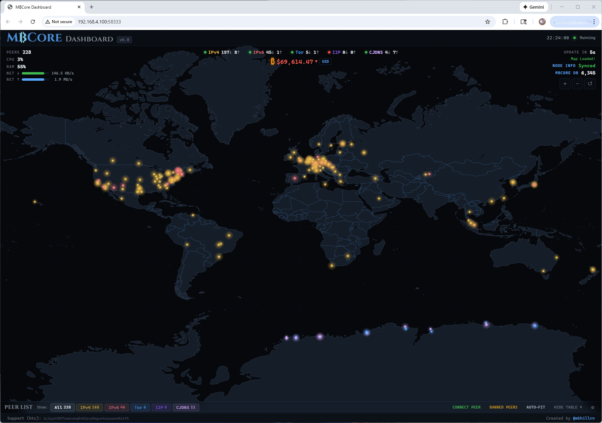
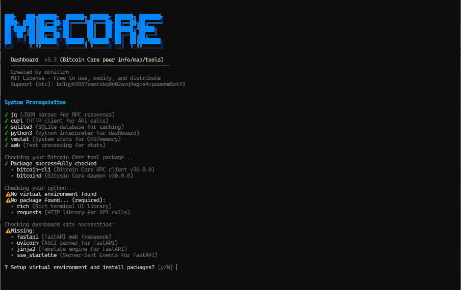
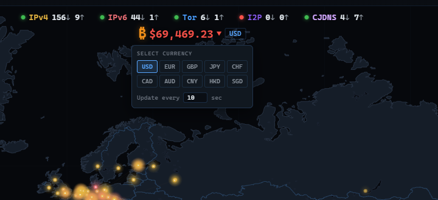
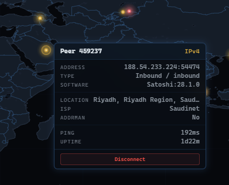
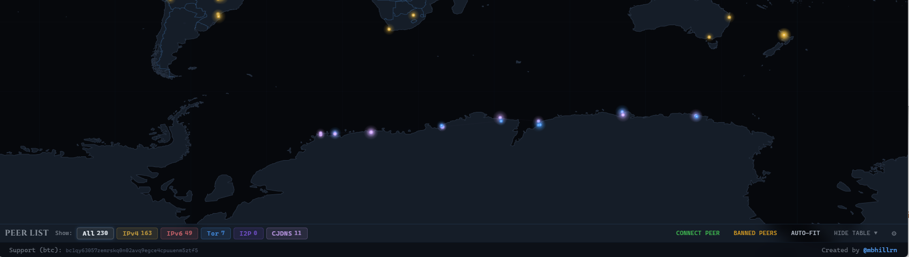
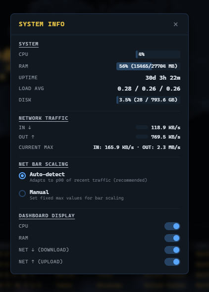
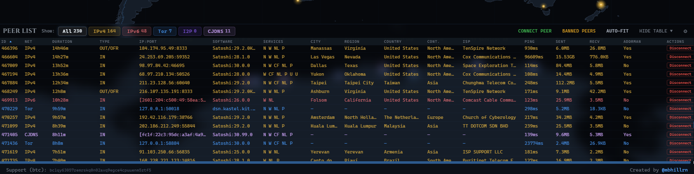
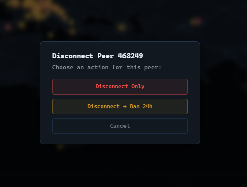
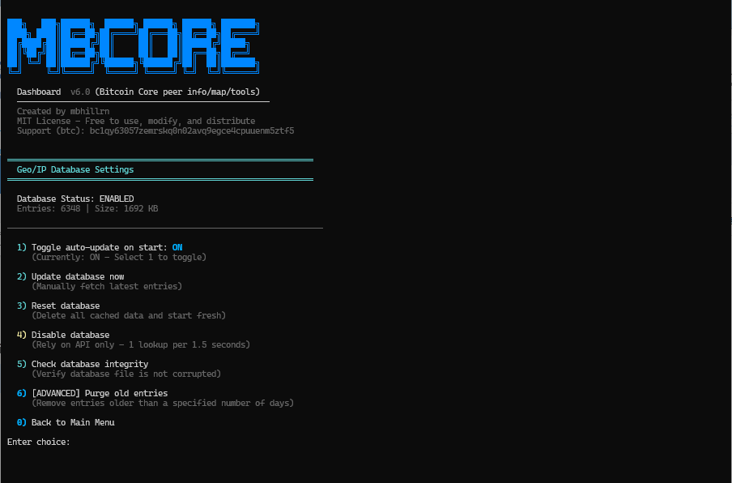
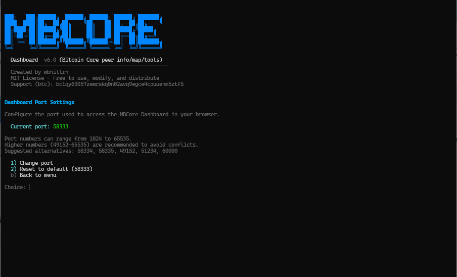

# MBCore Dashboard (Geolocated Peer Map and Tools for Bitcoin Core)

A real-time monitoring dashboard for Bitcoin Core nodes. Automatically geolocates your connected peers, places them on an interactive canvas world map, and provides tools to manage connections — all from your browser.




MBCore Dashboard uses `bitcoin-cli` to query your running Bitcoin Core node, geolocates public peers via [ip-api.com](http://ip-api.com), and maintains a local SQLite database of peer locations (latitude, longitude, ISP, AS info, and more) for instant recall. The database is continuously updated with new IP geolocations from the [Bitcoin Node GeoIP Dataset](https://github.com/mbhillrn/Bitcoin-Node-GeoIP-Dataset).

- Interactive HTML5 Canvas world map with geolocated Bitcoin Core peers
- Supports all 5 Bitcoin Core network types: **IPv4**, **IPv6**, **Tor**, **I2P**, **CJDNS**
- Real-time peer data, system stats, and live Bitcoin price
- Connect, disconnect, and ban peers directly from the dashboard
- Local GeoIP database with automatic updates — works offline for cached peers
- Zero config — auto-detects your Bitcoin Core installation
- Single script install, no accounts, no external services requiring signup

**Requires:** [Bitcoin Core](https://bitcoincore.org/) (`bitcoind`) installed and running.

---

## Quick Start

```bash
git clone https://github.com/mbhillrn/Bitcoin-Core-Peer-Map.git
cd Bitcoin-Core-Peer-Map
./da.sh
```

On first run, the script checks prerequisites and sets up a Python virtual environment:



Bitcoin Core is auto-detected and configured. The GeoIP database is automatically enabled and downloaded. If auto-detection can't find your setup (rare), use **m) Manual Settings** from the main menu to enter your paths.

You'll land at the main menu — press **1** to launch the dashboard:


The dashboard starts and shows your access URLs:


Open the URL in your browser and you're in.

For detailed access scenarios (headless servers, SSH tunnels, firewall setup), see the [QUICKSTART.md](QUICKSTART.md).

---

## Dashboard Overview

### Network Bar



The top bar shows each configured Bitcoin Core network (**IPv4**, **IPv6**, **Tor**, **I2P**, **CJDNS**) with real-time inbound/outbound peer counts. A colored dot indicates whether each network is enabled in your node's configuration. Hover over any network chip for additional details.

### Bitcoin Price

Below the network bar, the live Bitcoin price updates every 10 seconds (configurable). The price turns **green** when it goes up from the last update and **red** when it goes down. Click to change currency (USD, EUR, GBP, JPY, CHF, CAD, AUD, CNY, HKD, SGD) or adjust the update frequency.

### Map

The full-screen canvas map displays your node's connected peers as color-coded dots by network type. Click any peer dot to see detailed information:



The popup shows the peer's ID, address, network type, connection direction, software version, geographic location, ISP, ping latency, and connection duration. Pinned popups include a **Disconnect** button for quick peer management.

#### Private Networks (Antarctica)



Peers on private networks (Tor, I2P, CJDNS) don't have real geographic coordinates. These peers are placed at Antarctic research stations for visualization — their real locations are hidden by design.


Toggle Antarctica visibility from the Table Settings gear menu.

### Left Overlay — System Stats



The upper-left overlay shows at a glance:
- **Peers** — total connected peer count
- **CPU** — processor utilization percentage
- **RAM** — memory usage percentage
- **NET ↓ / NET ↑** — real-time network download/upload with animated bars

Click CPU, RAM, or NET for a detailed **System Info** modal with full breakdowns: CPU bar, RAM (MB used/total), system uptime, load averages, disk usage, and network traffic scaling options (auto-detect or manual). You can also toggle which stats appear on the overlay.

### Right Overlay — Node Info and Database

- **Update in** — countdown to next peer data refresh
- **Status** — geolocation progress for newly discovered peers
- **NODE INFO** — click to open a detailed modal with node version, peer count, blockchain size, TX index status, sync progress, block height, mempool size, and full blockchain/mempool details


The Node Info modal has three sections: **Node** (version, peers, disk size, pruning, sync status), **Mempool** (pending TXs, data size, memory usage, total fees, min accepted/relay fees, Full RBF status), and **Blockchain** (chain, block height, sync progress, best block hash, difficulty, median time, softforks).

- **MBCORE DB** — click for GeoIP database stats: entry count, database size, newest/oldest entry age, file path, auto-lookup and auto-update status, and an **Update Database** button to pull new geolocations without leaving the dashboard


### Peer Table



The bottom panel shows all connected peers in a sortable, filterable table. The header displays network filter badges with live peer counts.

**Default columns:** ID, Net, Duration, Type, IP:Port, Software, Services, City, Region, Country, Continent, ISP, Ping, Sent, Received, Addrman

**Features:**
- **Network filters** — filter by All, IPv4, IPv6, Tor, I2P, or CJDNS
- **Sortable** — click any column header (cycles: unsorted → ascending → descending)
- **Resizable** — drag column edges
- **Auto-fit** — automatically sizes columns to fit content; turns off when you manually resize
- **Hide/Show Table** — minimize the peer table for a full map view
- **Click to fly** — click any row to zoom to that peer on the map

16 columns visible by default, with 17+ additional columns available (country code, lat/lon, AS number, AS name, district, mobile, org, timezone, currency, hosting, proxy, ZIP, and more).

### Display Settings


Click the gear icon in the peer panel handle to access Display Settings:
- **Update Frequency** — configure how often peer data and node info are refreshed (3–120 seconds)
- **Show/Hide** — toggle visibility of Map Status, Node Info, and MBCore DB on the right overlay

### Table Settings

The gear (⚙) button opens Table Settings where you can:
- Adjust **panel transparency** (0–100% opacity slider)
- Toggle individual **columns** on/off
- Toggle **Private Networks in Antarctica**
- **Reset to Defaults** — restore default columns, transparency, and settings

### Connect Peer


Click **Connect Peer** to manually connect to a new peer. Enter an address in any supported format (IPv4, IPv6, Tor .onion, I2P .b32.i2p, CJDNS). The modal auto-generates the `bitcoin-cli addnode` command and a `bitcoin.conf` entry you can copy.

### Disconnect and Ban Peers



Click the **Disconnect** button on any peer row in the table to open the disconnect dialog. You can disconnect only, or disconnect and **ban the IP for 24 hours** (ban option available for IPv4/IPv6 peers only). Manage all active bans from the **Banned Peers** button in the peer panel header.

---

## Main Menu


| Option | Description |
|--------|-------------|
| **1) Enter MBCore Dashboard** | Launch the web dashboard |
| **2) Reset MBCore Config** | Clear saved configuration (option to keep or delete database) |
| **3) Firewall Helper** | Detect your network and configure UFW to allow dashboard access from other devices |
| **g) Geo/IP Database** | Manage the GeoIP cache — toggle auto-updates, check integrity, purge old entries |
| **m) Manual Settings** | Manually enter Bitcoin Core paths if auto-detection didn't work |
| **p) Port Settings** | Change the dashboard port (default: 58333, persists across restarts) |
| **u) Update** | Update to the latest version (appears when an update is available) |
| **q) Quit** | Exit |

### Geo/IP Database Settings



Manage the local GeoIP cache database. Toggle auto-updates on or off, check database integrity, view stats, download the latest dataset, or purge old entries.

### Port Settings



Change the dashboard port if 58333 conflicts with another service. The setting persists across restarts and updates.

### Firewall Helper

If another device on your network can't reach the dashboard, the built-in Firewall Helper (option **3**) detects your IP, subnet, and firewall status, then offers to add the rule for you. It also provides the command to reverse the change later.

---

## How It Works

```
┌─────────────────────────────────────────────────────────────────┐
│                        YOUR MACHINE                             │
│                                                                 │
│  ┌──────────────┐      bitcoin-cli      ┌──────────────────┐   │
│  │   bitcoind   │ ◄──────────────────► │  FastAPI Server   │   │
│  │ (Bitcoin Core)│        RPC           │  (Python :58333)  │   │
│  └──────────────┘                       └────────┬──────────┘   │
│                                                  │              │
│                                       HTTP + SSE │              │
│                                                  ▼              │
│                                       ┌──────────────────┐      │
│                                       │   Web Browser    │      │
│                                       │  (Canvas Map)    │      │
│                                       └──────────────────┘      │
└─────────────────────────────────────────────────────────────────┘
```

`./da.sh` auto-detects your Bitcoin Core node, launches a FastAPI server on port 58333, and serves the dashboard to your browser. Peer data updates via Server-Sent Events (SSE) for real-time changes.

Geolocation uses [ip-api.com](http://ip-api.com) (free, no API key required) for new peers, with results cached in a local SQLite database (`./data/geo.db`). The [Bitcoin Node GeoIP Dataset](https://github.com/mbhillrn/Bitcoin-Node-GeoIP-Dataset) provides pre-cached locations for thousands of known Bitcoin nodes.

---

## Compatibility

**Tested:**
- Ubuntu 22.04, 24.04, Linux Mint, Debian

**Should work:**
- Fedora, Arch Linux

If you run into issues on your system, [open an issue](https://github.com/mbhillrn/Bitcoin-Core-Peer-Map/issues).

---

## Dependencies

All dependencies are automatically detected and installed on first run.

| Tool | Purpose |
|------|---------|
| `bitcoin-cli` / `bitcoind` | Bitcoin Core RPC interface and daemon |
| `python3` | Python 3.8+ interpreter |
| `jq`, `curl`, `sqlite3` | JSON parsing, HTTP requests, database |
| `fastapi`, `uvicorn`, `jinja2`, `sse-starlette` | Web server (installed in local `./venv/`) |

---

## Project Structure

```
Bitcoin-Core-Peer-Map/
├── da.sh              # Main entry point
├── lib/               # Shell libraries (UI, config, prereqs)
├── scripts/           # Bitcoin Core detection
├── web/               # FastAPI server + frontend (HTML5 Canvas)
├── data/              # Local database and config (created on first run)
└── venv/              # Python virtual environment (created on first run)
```

---

## Troubleshooting

| Problem | Solution |
|---------|----------|
| Dashboard won't load from another device | Use the **Firewall Helper** (option 3) or manually allow port 58333 |
| Dashboard won't load at all | Close old browser tabs, check `ss -tlnp \| grep 58333` for port conflicts |
| Bitcoin Core not detected | Make sure `bitcoind` is running, or use **m) Manual Settings** |
| Peers show "Unknown" location | Geolocation is in progress — new peers are looked up as they connect |

---

## License

MIT License — Free to use, modify, and distribute.

## Support

If you find this useful, consider a donation:

**Bitcoin:** `bc1qy63057zemrskq0n02avq9egce4cpuuenm5ztf5`

---

*Created by [@mbhillrn](https://github.com/mbhillrn/Bitcoin-Core-Peer-Map)*
