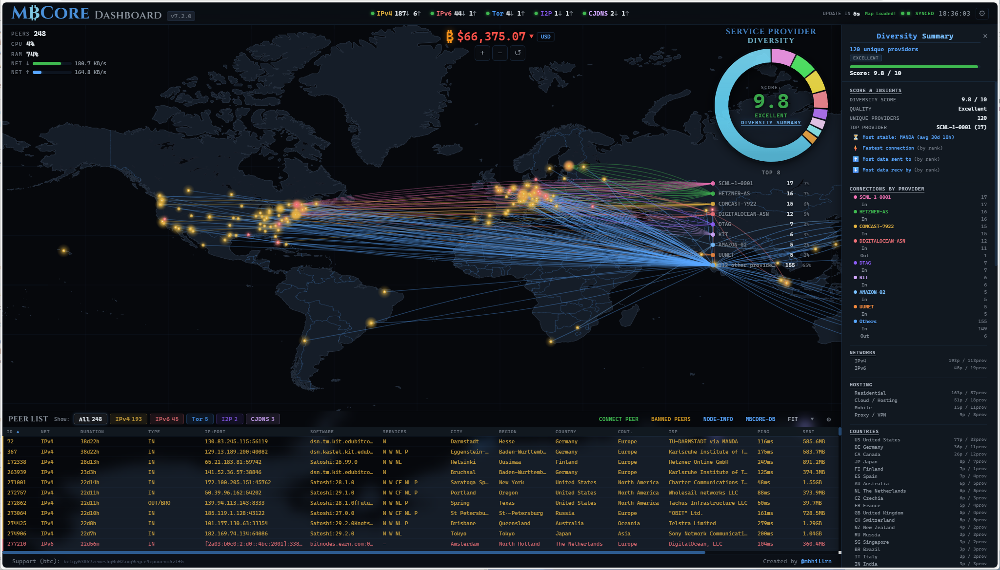
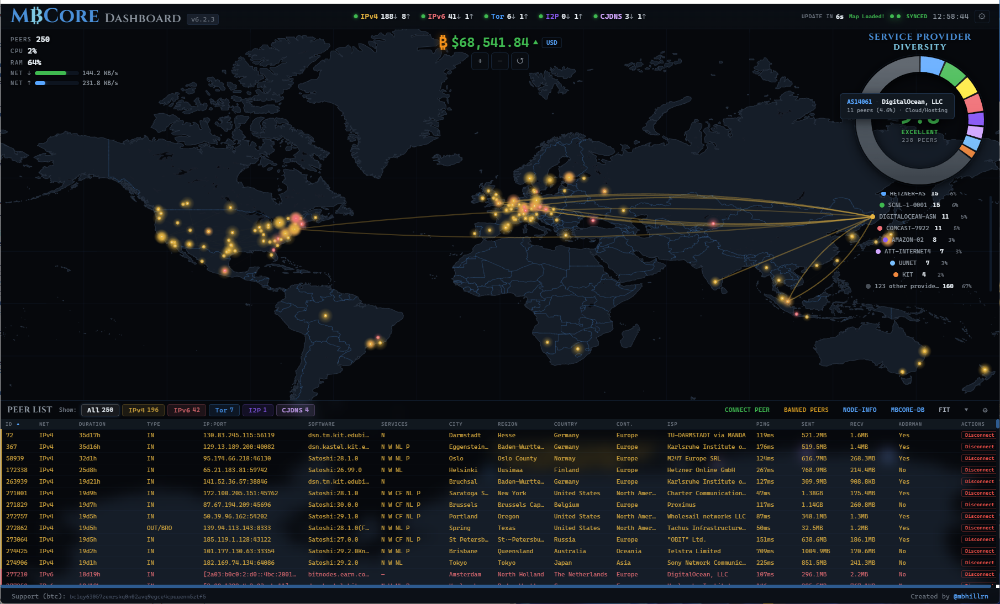
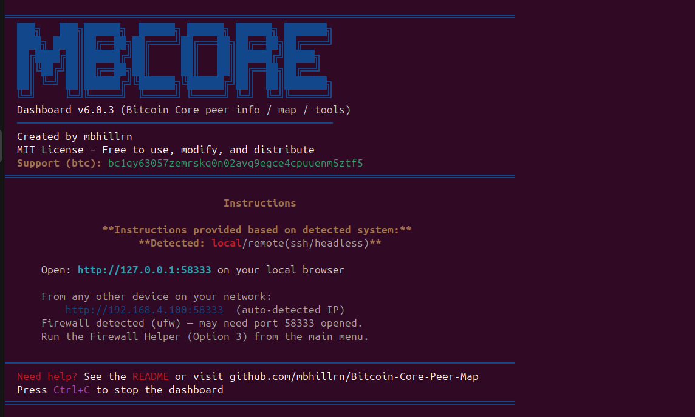
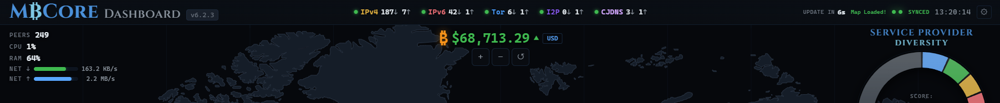
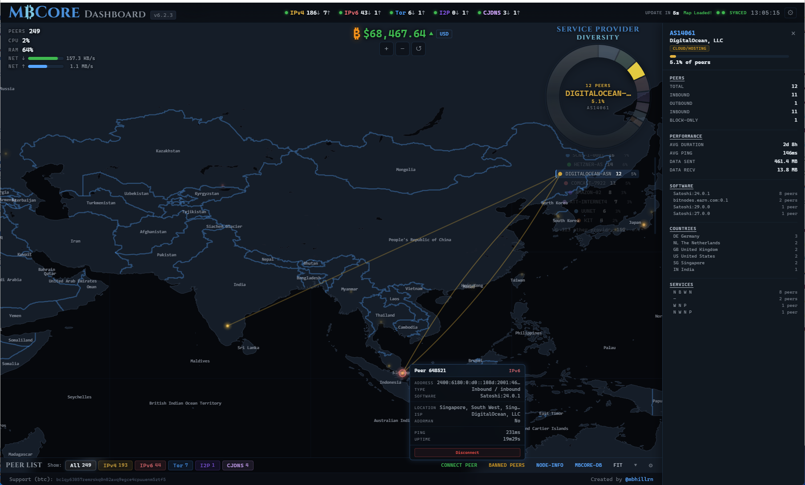
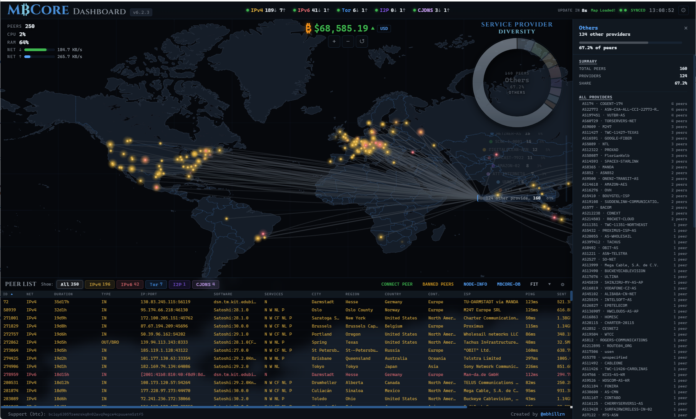
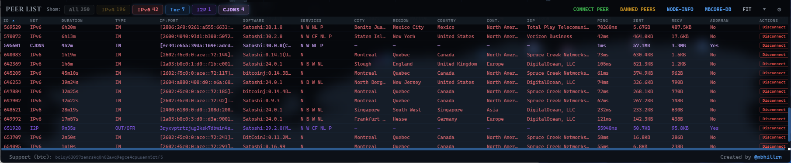

# MBCore Dashboard (Bitcoin Core Geolocated Peer Map, Autonomous System Analysis, GUI, and Tools)

A real-time monitoring dashboard for your personal Bitcoin Core node. Geolocates connected peers on an interactive canvas world map, analyzes service provider diversity across your peer connections, and provides tools to manage peers directly, all from a browser graphical user interface.






*Selecting a service provider on the donut chart draws animated connection lines to all peers hosted by that provider (Digital Ocean, LLC shown above), with a full breakdown in the detail panel.*

MBCore Dashboard uses `bitcoin-cli` to query your running Bitcoin Core node, geolocates public peers via a maintained database and online IP geolocation searches like [ip-api.com](http://ip-api.com), and aggregates peer data by Autonomous System (AS) to visualize how your connections are distributed across internet service providers and hosting companies. Maintains a local SQLite database of peer locations (latitude, longitude, ISP, AS info, and more) for instant recall. The database is continuously updated with new IP geolocations from the [Bitcoin Node GeoIP Dataset](https://github.com/mbhillrn/Bitcoin-Node-GeoIP-Dataset).

- Interactive HTML5 Canvas world map with geolocated Bitcoin Core peers
- **Service provider diversity analysis** -- donut chart with diversity score, concentration risk, and per-provider detail panel
- Supports all 5 Bitcoin Core network types: **IPv4**, **IPv6**, **Tor**, **I2P**, **CJDNS**
- Real-time peer data, system stats, and live Bitcoin price
- Connect, disconnect, and ban peers directly from the dashboard
- Local GeoIP database with automatic updates, works offline for cached peers
- Dark, light, OLED, and midnight themes with fully customizable map appearance
- Zero config, auto-detects your Bitcoin Core installation
- Single script install, no accounts, no external services requiring signup

**Requires:** [Bitcoin Core](https://bitcoincore.org/) (`bitcoind`) installed and running.

---

## Quick Start

```bash
git clone https://github.com/mbhillrn/Bitcoin-Core-Peer-Map.git
cd Bitcoin-Core-Peer-Map
./da.sh
```

On first run, the script checks prerequisites and sets up a Python virtual environment:


Bitcoin Core is auto-detected and configured. The GeoIP database is automatically enabled and downloaded. If auto-detection can't find your setup (rare), use **m) Manual Settings** from the main menu to enter your paths.

You'll land at the main menu. Press **1** to launch the dashboard:


If the geolocation service is unreachable (no internet), you'll see a warning before the dashboard launches. Your local GeoIP database is used automatically for cached peers. Press **Enter** to continue or **R** to retry:


The dashboard starts and shows access URLs tailored to your detected environment:

**Local (desktop):** Shows your localhost URL with a LAN address for other devices on your network.



**Remote (SSH/headless):** Shows your LAN IP as the primary URL, with firewall guidance if one is detected.


Open the URL in your browser and you're in.

---

## Dashboard Overview

### Top Bar



The top bar contains all primary information and navigation:

**Left:** The MBCore Dashboard logo and version number (click to visit the GitHub repo).

**Center (top row):** All five Bitcoin Core network types as individual chips: **IPv4**, **IPv6**, **Tor**, **I2P**, and **CJDNS**. Each chip displays a colored status dot, the protocol name, and live inbound/outbound peer counts.

- **Green dot** -- the network is enabled and has active peers
- **Red/gray dot** -- the network is disabled or has no connected peers

Each chip shows real-time counts like `3↓ 5↑`. When a peer connects or disconnects, an animated delta indicator briefly appears next to the affected count.

**Right (top row):** Update countdown, map load status, sync indicator, and current time.

**Left (below):** System stats overlay -- **Peers** total count, **CPU** utilization, **RAM** usage, and **NET ↓/↑** real-time network throughput with animated bars. Click any stat for a detailed system info modal.

**Center (below):** Live Bitcoin price with configurable currency and update frequency. Price turns **green** on increases and **red** on decreases. Below the price are map zoom controls (+/−) and a gear icon for Map Settings.

**Right (below):** The top portion of the Service Provider Diversity donut chart.

### Service Provider Diversity



The **Service Provider Diversity** donut chart in the upper-right corner of the map visualizes how your node's public peers are distributed across internet service providers, hosting companies, and other network operators (identified by their Autonomous System number). This helps you understand your node's network diversity -- whether your connections are well-distributed or concentrated with a few large providers, which could represent a single point of failure or increase susceptibility to targeted network disruptions.

**Donut Chart:**
- Displays the top 8 service providers by peer count, each as a color-coded segment
- Providers with fewer peers are grouped into an "Others" category
- Hovering any segment or legend item shows a tooltip with provider name, peer count, percentage, and concentration risk level
- Clicking a segment selects that provider: draws animated connection lines from the legend to every peer on the map hosted by that provider, filters the peer list, and opens the detail panel

**Diversity Score (0-10):**
- Displayed in the center of the donut with the number of public peers analyzed
- Higher scores indicate better distribution across providers
- Color-coded quality rating: **Excellent** (8+), **Good** (6-8), **Moderate** (4-6), **Poor** (2-4), **Critical** (0-2)
- The score accounts for both the number of unique providers and how evenly peers are spread among them

**Legend:**
- Appears when hovering over the donut area
- Shows each provider's color, abbreviated name, peer count, and percentage
- Stays visible while a provider is selected
- Connection lines originate from the legend dots to peers on the map

**Detail Panel:**

Clicking a provider segment opens a slide-in panel on the right side with comprehensive per-provider information:

- **Peers** -- total, inbound, outbound, block-relay-only counts
- **Performance** -- average connection duration, average ping latency, total data sent/received
- **Software** -- breakdown of Bitcoin Core versions running on that provider's peers
- **Countries** -- geographic distribution of peers within that provider
- **Services** -- service flags advertised by peers on that provider
- Click any individual peer row in the panel to view its popup on the map, or disconnect it directly



*Selecting the "Others" segment shows a full list of all providers in that category with their AS numbers and names, along with summary statistics for the group.*

**Diversity Summary:**

Hovering or clicking the donut center opens the **Diversity Summary** panel, which gives you a high-level overview of your node's peer connections ranked by provider:

- **Connections by Provider** -- each provider is listed with Total, Inbound, and Outbound peer counts on separate rows. Click any provider name to open its full detail panel. Hover a provider row to draw connection lines to its peers on the map.
- **Most Stable Connection (by rank)** -- providers ranked by average connection duration of their peers. Hover to preview, click to pin. Expanding a provider shows a numbered list of individual peers sorted by uptime, each clickable to zoom to the peer on the map.
- **Fastest Connection (by rank)** -- providers ranked by average ping latency (lowest first). Same hover-to-preview and click-to-pin behavior. Expanding a provider shows peers sorted by ping time.
- **Most Data Sent To (by rank)** -- providers ranked by total bytes sent. Expanding shows individual peers ranked by bytes sent.
- **Most Data Recv By (by rank)** -- providers ranked by total bytes received. Expanding shows peers ranked by bytes received.

**Sub-menus and drill-down:**

The detail panel, provider rows, and insight sections all support a three-level drill-down system. Clicking a category (like Software or Countries) in a provider panel opens a sub-menu listing the breakdown. Clicking an item in that sub-menu (like a specific Bitcoin Core version) opens a sub-sub-menu listing the individual peers. Each peer entry is clickable to zoom to that peer on the map. Sub-menus stay pinned until you click elsewhere, and they survive automatic data refreshes so you don't lose your place while exploring.

### Map

The full-screen canvas map displays your node's connected peers as color-coded dots by network type. Click any peer dot to see detailed information including peer ID, address, network type, connection direction, software version, geographic location, ISP, ping latency, and connection duration. Pinned popups include a **Disconnect** button for quick peer management.

#### Private Networks (Antarctica)

Peers on private networks (Tor, I2P, CJDNS) don't have real geographic coordinates. These peers are placed at Antarctic research stations for visualization. Their real locations are hidden by design. Toggle Antarctica visibility from the Table Settings gear menu on the peer list.

### Peer List



The bottom panel shows all connected peers in a sortable, filterable table.

**Title bar features:**
- **Network filters** -- filter by All, IPv4, IPv6, Tor, I2P, or CJDNS (with live peer counts)
- **Connect Peer** -- manually connect to a new peer in any supported format
- **Banned Peers** -- view and manage the ban list
- **NODE-INFO** -- open the node information modal (version, blockchain, mempool details)
- **MBCORE-DB** -- open the GeoIP database modal (stats, auto-update toggle, manual update)
- **FIT** -- auto-size columns to fit content
- **▼** -- collapse/expand the peer table
- **⚙** -- table settings (transparency, visible rows, column toggles, Antarctica setting)

**Table features:**
- **Sortable** -- click any column header (cycles: unsorted → ascending → descending). Sent, Received, Duration, and Ping columns sort numerically by actual values.
- **Resizable** -- drag column edges to adjust width
- **Click to fly** -- click any row to zoom to that peer on the map
- **Visible rows** -- configurable from the table settings gear (default: 15 rows visible, scrollable beyond)

#### Default Columns (16 visible)

| Column | Label | Description |
|--------|-------|-------------|
| ID | ID | Peer identifier assigned by Bitcoin Core |
| Net | Net | Network type: IPv4, IPv6, Tor, I2P, or CJDNS |
| Duration | Duration | How long the peer has been connected (formatted as hours/minutes/seconds) |
| Type | Type | Connection type and direction (see connection types below) |
| IP:Port | IP:Port | Peer's network address and port |
| Software | Software | The peer's Bitcoin Core version string (subver) |
| Services | Services | Service flags advertised by the peer (see service flags below) |
| City | City | Geolocated city |
| Region | Region | State or province |
| Country | Country | Country name |
| Continent | Cont. | Continent abbreviation |
| ISP | ISP | Internet Service Provider |
| Ping | Ping | Round-trip latency in milliseconds |
| Sent | Sent | Total bytes sent to this peer |
| Received | Recv | Total bytes received from this peer |
| Addrman | Addrman | Whether this peer's address is in Bitcoin Core's address manager (Yes/No) |

#### Advanced Columns (17 additional, hidden by default)

Enable these from the Table Settings gear menu. These provide deeper geolocation and network metadata.

| Column | Label | Description |
|--------|-------|-------------|
| Direction | Dir | IN or OUT (raw direction without connection type) |
| Country Code | CC | Two-letter country code (e.g. US, DE, JP) |
| Continent Code | CntC | Continent code (e.g. NA, EU, AS) |
| Latitude | Lat | Geographic latitude (2 decimal places) |
| Longitude | Lon | Geographic longitude (2 decimal places) |
| Region Code | Rgn | State/province abbreviation code |
| AS Number | AS | Autonomous System number (e.g. AS13335) |
| AS Name | AS Name | Organization that owns the AS (e.g. Cloudflare, Hetzner) |
| District | District | Sub-city regional subdivision (where available) |
| Mobile | Mob | Whether the peer is on a mobile/cellular network (Y/N) |
| Organization | Org | Organization name associated with the IP |
| Timezone | TZ | Peer's timezone (e.g. America/New_York) |
| Currency | Curr | Local currency for the peer's country |
| Hosting | Host | Whether the IP belongs to a hosting/datacenter provider (Y/N) |
| UTC Offset | UTC | UTC offset in seconds |
| Proxy | Proxy | Whether the IP is a known proxy (Y/N) |
| ZIP | ZIP | Postal/ZIP code |

#### Connection Types

The **Type** column shows how each peer is connected. Outbound peers include the subtype after a slash (e.g. `OUT/OFR`). Hover any type for the full description.

| Abbreviation | Full Name | Description |
|-------------|-----------|-------------|
| IN | Inbound | A peer that connected to your node |
| OFR | Outbound Full Relay | Your node connected for full block and transaction relay |
| BRO | Block Relay Only | Your node connected for blocks only (no transaction relay, for privacy) |
| MAN | Manual | A peer you manually connected to via `addnode` |
| AF | Address Fetch | A short-lived connection to learn about other peers' addresses |
| FLR | Feeler | A short-lived connection to test if an address in the address manager is reachable |

#### Service Flags

The **Services** column shows abbreviated service flags that each peer advertises. These indicate what capabilities the peer supports. Hover over the services cell to see full descriptions.

| Flag | Name | Bitcoin Core Constant | What It Means |
|------|------|----------------------|---------------|
| **N** | Network | NODE_NETWORK | The peer stores and serves the **complete blockchain history**. It can provide any historical block on request. Most full nodes advertise this flag. |
| **W** | Witness | NODE_WITNESS | The peer supports **Segregated Witness** (SegWit). It can relay and validate witness data for transactions. Nearly all modern nodes have this. |
| **NL** | Network Limited | NODE_NETWORK_LIMITED | The peer stores only the **last 288 blocks** (roughly 2 days of history). This is typical of pruned nodes that keep a minimal chain tail. NL peers can still relay new blocks and transactions normally. |
| **P** | P2P V2 | P2P_V2 | The peer supports **BIP324 encrypted transport**. All traffic between your node and this peer is encrypted, preventing passive eavesdropping on the connection. |
| **CF** | Compact Filters | NODE_COMPACT_FILTERS | The peer serves **BIP157/158 compact block filters**, which allow lightweight clients to privately determine whether a block contains relevant transactions without downloading the full block. |
| **B** | Bloom | NODE_BLOOM | The peer supports **BIP37 Bloom filters**, an older lightweight client protocol. Bloom filters allow SPV wallets to request only transactions matching a filter pattern, though they leak some privacy to the serving node. |

A typical modern full node will show `N W P` (full chain, SegWit, encrypted transport). A pruned node will show `NL W P` instead of `N W P`.

### Map Settings

Click the **gear icon** below the Bitcoin price area to open Map Settings:

- **Update Frequency** -- configure how often peer data and node info are refreshed (3-120 seconds)
- **Show / Hide** -- toggle visibility of the Service Provider Diversity donut, Bitcoin price display, and system stats overlay
- **Advanced** -- opens the Advanced Display Settings panel (see below)

### Advanced Display Settings

Click **Advanced** at the bottom of the Map Settings popup to open a floating, draggable panel with full control over the map's visual appearance. All changes are live and you see the effect immediately as you drag each slider.

**Theme**

Choose from four built-in themes that set all sliders to curated presets:
- **Dark** -- the original dark canvas dashboard, ideal for low-light environments
- **Light** -- bright, clean interface with green land and blue ocean, best for well-lit rooms
- **OLED** -- pure black for OLED screens, maximum contrast, minimum power draw
- **Midnight** -- deep indigo-blue tones with purple accents, rich and atmospheric

**Service Provider Diversity**
- **Line Thickness** -- width of the connection lines drawn from the donut to peers on the map (default 30)
- **Line Fanning** -- how much curved lines spread apart when multiple peers share the same location (default 50)

**Peer Effects**
- **Shimmer** -- ambient twinkle intensity for long-lived peers (0 = off, which is the default)
- **Pulse Depth In / Out** -- how deep the breathing pulse goes for inbound vs outbound peers
- **Pulse Speed In / Out** -- how fast the pulse cycles (50 = original speed)

**Land**
- **Hue** -- shift the land color across the full spectrum (default 215 = dark blue-gray)
- **Brightness** -- darken or brighten the landmasses
- **Snow the Poles** -- gradually frost Antarctica and Arctic regions with an icy gray-white

**Ocean**
- **Preset** -- choose between Original (full hue range) and Light Blue (constrained sky blue range)
- **Hue** -- shift the ocean color (range depends on selected preset)
- **Brightness** -- darken or brighten the ocean and lakes

**Lat/Lon Grid**
- **Visible** -- toggle the latitude/longitude grid on or off
- **Thickness** -- grid line width
- **Hue** -- shift the grid line color
- **Brightness** -- grid line opacity

**Borders**
- **Thickness** -- scale country and state/region borders together (0 = hidden, 50 = default, 100 = 2x thick)
- **Hue** -- shift the border line color

**HUD Overlays**
- **Solid Backgrounds** -- adds semi-opaque backgrounds behind stats, price, and info panels for improved readability on lighter maps

**Saving and Resetting**
- **Session Save** -- keeps your settings for the current session only (closes the panel)
- **Permanent Save** -- persists your settings to localStorage so they survive browser refreshes and new sessions
- **Reset** -- snaps every slider back to the original defaults and resets the theme to Dark
- Every slider label is a clickable link that resets just that one slider to its default

### Table Settings

The gear (⚙) button on the peer list title bar opens Table Settings:
- **Transparency** -- adjust panel opacity (0-100% slider)
- **Visible Rows** -- control how many peer rows are displayed before scrolling (3-40, default 15)
- **Column Toggles** -- show or hide any column
- **Private Networks** -- toggle Antarctica display for Tor/I2P/CJDNS peers
- **Defaults** -- restore default columns, transparency, visible rows, and all settings

### Connect Peer


Click **Connect Peer** to manually connect to a new peer. Enter an address in any supported format (IPv4, IPv6, Tor .onion, I2P .b32.i2p, CJDNS). The modal auto-generates the `bitcoin-cli addnode` command and a `bitcoin.conf` entry you can copy.

### Disconnect and Ban Peers


Click the **Disconnect** button on any peer row in the table to open the disconnect dialog. You can disconnect only, or disconnect and **ban the IP for 24 hours** (ban option available for IPv4/IPv6 peers only). Manage all active bans from the **Banned Peers** button in the peer list title bar.

---

## Main Menu


| Option | Description |
|--------|-------------|
| **1) Enter MBCore Dashboard** | Launch the web dashboard |
| **2) Reset MBCore Config** | Clear saved configuration (option to keep or delete database) |
| **3) Firewall Helper** | Detect your network and configure UFW to allow dashboard access from other devices |
| **g) Geo/IP Database** | Manage the GeoIP cache, toggle auto-updates, check integrity, purge old entries |
| **m) Manual Settings** | Manually enter Bitcoin Core paths if auto-detection didn't work |
| **n) Network/Port** | Server security, access mode (local-only vs LAN), and port settings |
| **u) Update** | Update to the latest version (appears when an update is available) |
| **q) Quit** | Exit |

### Geo/IP Database Settings


Manage the local GeoIP cache database. Toggle auto-updates on or off, check database integrity, view stats, download the latest dataset, or purge old entries. The auto-update setting syncs with the web dashboard -- toggling it in one place updates the other.

### Network/Port Settings


Change the dashboard port if 58333 conflicts with another service, or switch between LAN-accessible (0.0.0.0) and local-only (127.0.0.1) server modes. Local-only mode restricts the dashboard to the machine running Bitcoin Core. LAN mode (default) allows access from any device on your network. All settings persist across restarts and updates.

### Firewall Helper

The Firewall Helper (option **3**) assists with opening the dashboard port so other devices on your local network can access it. It detects your IP, subnet, and firewall status, then offers to add the rule for you and provides the command to reverse it later. You can also open the port manually if you prefer. This is only needed if you want to view the dashboard from another device on your local network (e.g. a laptop, phone, or another machine on the same Wi-Fi or LAN). Opening this port to the public internet is not recommended.

### Automatic Updates

MBCore Dashboard has two independent auto-update systems: one for the application itself and one for the GeoIP database.

**System Update Check (Application)**

The dashboard automatically checks GitHub for new versions of MBCore Dashboard:
- Checks on dashboard startup, then every 55 minutes while the dashboard is open
- The backend fetches the remote `VERSION` file from the GitHub repository and compares it to the locally installed version
- Results are cached for 30 minutes to avoid excessive network requests
- When a new version is available, a banner appears in the top-right corner of the dashboard: **"Update Available! v6.2.2 -> v6.3.0"** (for example)
- Hover the banner to see the changelog (pulled from the `CHANGES` file) and instructions for how to update
- From the terminal menu, use **u) Update** to pull the latest version via `git pull` and auto-restart

**GeoIP Database Auto-Update**

The GeoIP database that stores peer locations can also update itself:
- When enabled, the database syncs from the [Bitcoin Node GeoIP Dataset](https://github.com/mbhillrn/Bitcoin-Node-GeoIP-Dataset) at startup and once per hour while the dashboard is running
- Toggle auto-update on/off from the dashboard's **MBCORE-DB** modal (green/red slider) or from the terminal's **g) Geo/IP Database** menu
- The setting syncs between the dashboard and terminal -- toggling it in one place updates the other
- A brief status message appears in the top bar during updates: countdown, checking, and result ("DB already up to date" or "DB successfully updated")
- When auto-update is disabled, the database still works with whatever data it already has cached

---

## How It Works

```
┌─────────────────────────────────────────────────────────────────┐
│                        YOUR MACHINE                             │
│                                                                 │
│  ┌──────────────┐      bitcoin-cli      ┌──────────────────┐   │
│  │   bitcoind   │ ◄──────────────────► │  FastAPI Server   │   │
│  │ (Bitcoin Core)│        RPC           │  (Python :58333)  │   │
│  └──────────────┘                       └────────┬──────────┘   │
│                                                  │              │
│                                       HTTP + SSE │              │
│                                                  ▼              │
│                                       ┌──────────────────┐      │
│                                       │   Web Browser    │      │
│                                       │  (Canvas Map)    │      │
│                                       └──────────────────┘      │
└─────────────────────────────────────────────────────────────────┘
```

`./da.sh` auto-detects your Bitcoin Core node, launches a FastAPI server on port 58333, and serves the dashboard to your browser. Peer data updates via Server-Sent Events (SSE) for real-time changes.

Geolocation uses automated IP geolocation API services such as [ip-api.com](http://ip-api.com) (free, no API key required) for new peers, with results cached in a local SQLite database (`./data/geo.db`). The [Bitcoin Node GeoIP Dataset](https://github.com/mbhillrn/Bitcoin-Node-GeoIP-Dataset) provides pre-cached locations for tens of thousands of known Bitcoin node addresses and grows daily. Every new unique address your node encounters is added to your local database automatically. The system periodically checks the dataset repository for newly discovered addresses and merges only what you don't already have. Your locally discovered addresses stay local and are never uploaded to the repository.

Service provider diversity analysis runs entirely client-side -- peer AS (Autonomous System) data is aggregated in the browser, the diversity score is calculated from the distribution, and the donut chart, legend, and detail panel are rendered in real time as peers connect and disconnect.

### Network & Security

MBCore Dashboard runs a local web server on your machine and is designed to be accessed from your local network. It binds to your machine's network interface so that other devices on your LAN (a phone, laptop, or another machine on the same Wi-Fi) can view the dashboard in a browser. It is not accessible from the internet unless you explicitly port-forward it through your router, which is not recommended.

Peer geolocation uses automated IP geolocation API services to look up publicly available location data for connected peers. This is the same type of information any website you visit already sees. The geolocation API transmits over HTTP due to free tier service requirements, which is standard for these lookups and poses no risk to your node as long as your local network is trusted and secured.

The GeoIP database updates automatically from the [Bitcoin Node GeoIP Dataset](https://github.com/mbhillrn/Bitcoin-Node-GeoIP-Dataset) via HTTPS and can be toggled off from the dashboard or terminal menu. Downloaded databases are validated against the expected SQLite structure before merging to ensure integrity. Application updates are pulled via git from this repository over HTTPS.

---

## Compatibility

**Tested:**
- Ubuntu 22.04, 24.04, Linux Mint, Debian

**Should work:**
- Fedora, Arch Linux

If you run into issues on your system, [open an issue](https://github.com/mbhillrn/Bitcoin-Core-Peer-Map/issues).

---

## Dependencies

All dependencies are automatically detected and installed on first run.

| Tool | Purpose |
|------|---------|
| `bitcoin-cli` / `bitcoind` | Bitcoin Core RPC interface and daemon |
| `python3` | Python 3.8+ interpreter |
| `jq`, `curl`, `sqlite3` | JSON parsing, HTTP requests, database |
| `fastapi`, `uvicorn`, `jinja2`, `sse-starlette` | Web server (installed in local `./venv/`) |

---

## Project Structure

```
Bitcoin-Core-Peer-Map/
├── da.sh              # Main entry point
├── lib/               # Shell libraries (UI, config, prereqs)
├── scripts/           # Bitcoin Core detection
├── web/               # FastAPI server + frontend (HTML5 Canvas)
├── data/              # Local database and config (created on first run)
└── venv/              # Python virtual environment (created on first run)
```

---

## Troubleshooting

| Problem | Solution |
|---------|----------|
| Dashboard won't load from another device | Use the **Firewall Helper** (option 3) or manually allow port 58333 |
| Dashboard won't load at all | Close old browser tabs, check `ss -tlnp \| grep 58333` for port conflicts |
| Bitcoin Core not detected | Make sure `bitcoind` is running, or use **m) Manual Settings** |
| Peers show "Unknown" location | Geolocation is in progress, new peers are looked up as they connect |

---

## License

MIT License. Free to use, modify, and distribute.

## Support

If youre feeling generous:

**Bitcoin:** `bc1qy63057zemrskq0n02avq9egce4cpuuenm5ztf5`

---

*Created by [@mbhillrn](https://github.com/mbhillrn/Bitcoin-Core-Peer-Map)*
