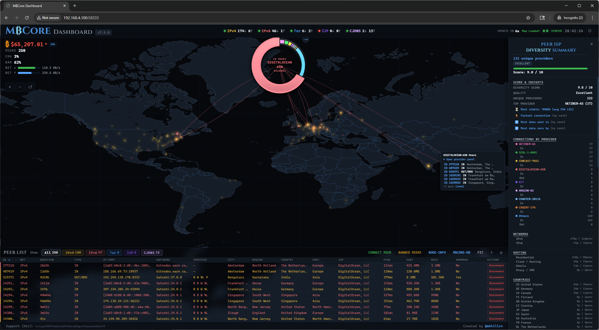
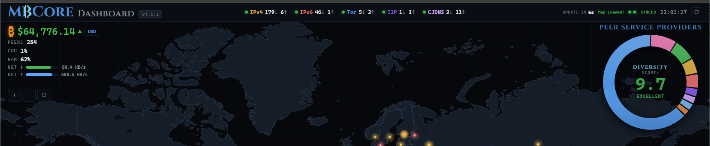
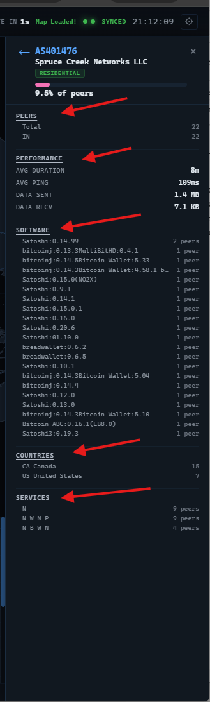
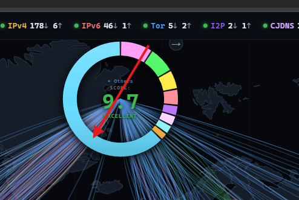
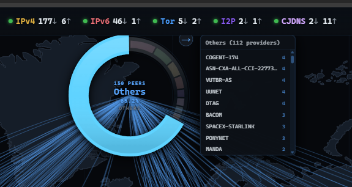
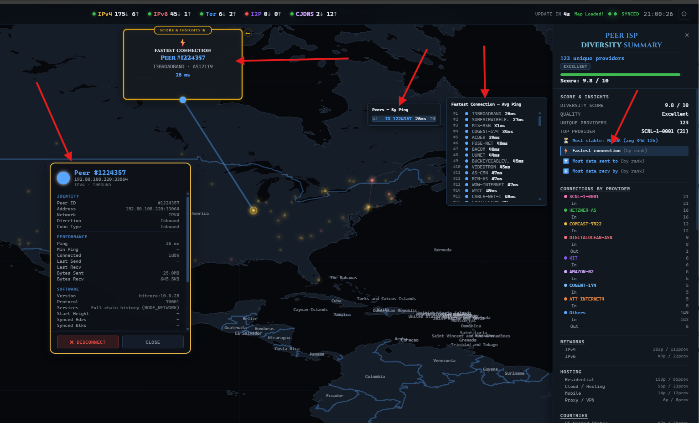
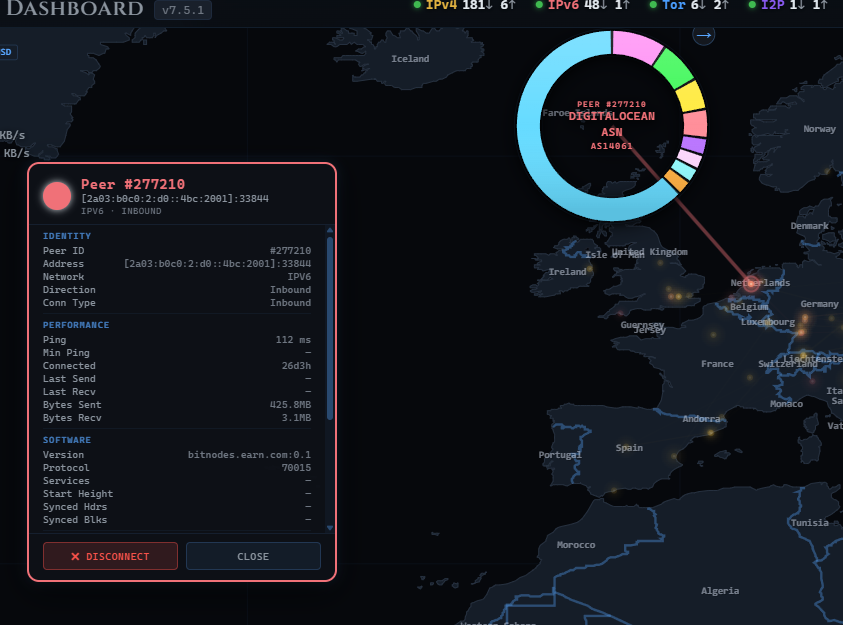
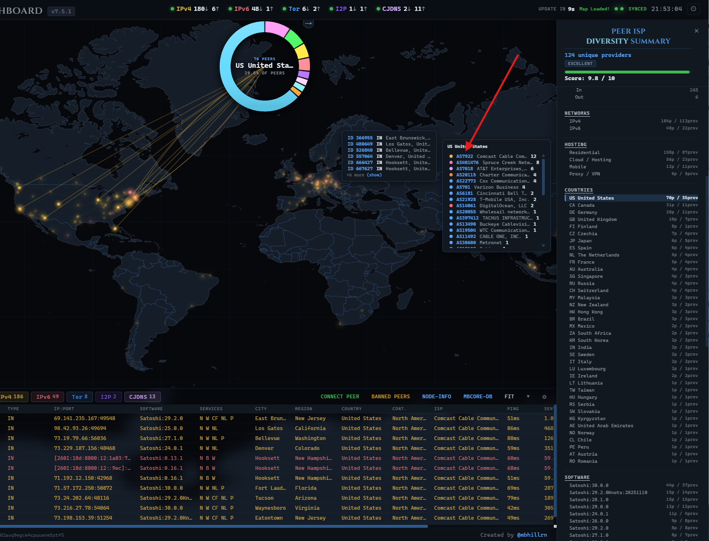

# MBCore Dashboard — Bitcoin Core Geolocated Peer Map, Visualizer, Network Analyzer, and Node Management GUI Tools

### A real-time monitoring dashboard for your personal Bitcoin Core node. Geolocates connected peers on an interactive canvas world map, analyzes service provider diversity across your peer connections, and provides tools to manage peers directly, all from a browser graphical user interface.

### Real-Time Bitcoin Core Peer Map | ISP Diversity Analysis | Autonomous System Tracking | Geolocated Node Explorer | Interactive Network Dashboard | Peer Management Tools

---

MBCore Dashboard is a comprehensive real-time visualization and analysis tool available for your personal Bitcoin Core node's peer-to-peer network. It transforms your node's raw peer data into a fully interactive, geolocated world map where every single connected peer is plotted, searchable, filterable, and explorable — down to the individual connection level — across every dimension: location, service provider, software version, connection speed, data transfer, network protocol, hosting type, service flags, and more.

Every peer. Every provider. Every metric. All searchable, all filterable, all drillable — from a high-level diversity overview all the way down to a single peer on the map.





*Select any service provider on the donut chart to draw animated connection lines from the chart to every peer hosted by that provider on the map, with a full breakdown of peers, performance, software, countries, and services in the slide-in detail panel. Click the center of the donut to open the Peer ISP Diversity Summary — a comprehensive analysis panel where every category drills all the way down to individual peers.*

---

## What Makes This Different

MBCore Dashboard doesn't just show you dots on a map. It gives you the ability to explore, analyze, and understand your node's entire peer network through a deeply interconnected drill-down system. Nearly everything you see is clickable, and nearly every click takes you deeper:

- **Start anywhere** — click a provider on the donut chart, a country in the summary panel, a service flag, a software version, a hosting type, or a network protocol
- **Drill to providers** — see which ISPs and hosting companies serve peers in that category, ranked by peer count
- **Drill to peers** — expand any provider to see its individual peers with connection type, location, and stats
- **Drill to the map** — click any peer to zoom to its exact location on the map, draw a connection line, and open its full detail popup with 30+ fields of information
- **Everything survives refresh** — your drill-down state, selected peer, panel position, and scroll location all persist through automatic data updates so you never lose your place

This means you can answer questions like "Which of my peers running Satoshi 28.1.0 are on residential connections in Germany?" or "Which provider gives me the fastest ping and how long have those peers been connected?" — entirely through point-and-click navigation, no command line required.

---

## Key Features

- **Interactive HTML5 Canvas world map** with every connected peer geolocated and color-coded by network type
- **Service provider (ISP/AS) diversity analysis** — animated donut chart with diversity score, concentration risk assessment, and deep per-provider breakdowns
- **Peer ISP Diversity Summary** — a dedicated analysis panel with Score & Insights, Connections by Provider, Most Stable, Fastest Connection, Most Data Sent/Received rankings, plus full filtering by Network, Hosting Type, Country, Software, and Services
- **Three-level drill-down system** — from category → provider → individual peer on the map, across every dimension
- **Full peer detail popups** with 30+ fields: ID, address, port, network, direction, connection type, software, protocol version, services, location, ISP, AS, ping, min ping, connection duration, bytes sent/received, addrman status, addr relay, hosting type, BIP152 high-bandwidth status, and more
- **Supports all 5 Bitcoin Core network types**: IPv4, IPv6, Tor, I2P, CJDNS
- **Real-time system stats** — CPU, RAM, network throughput, peer counts — with live animated bars
- **Live Bitcoin price** with configurable currency and color-coded price movement
- **Peer management** — connect, disconnect, and ban peers directly from the dashboard
- **33-column sortable, filterable peer table** (16 default + 17 advanced) with click-to-fly-to-map on every row
- **Local GeoIP database** with automatic updates from the [Bitcoin Node GeoIP Dataset](https://github.com/mbhillrn/Bitcoin-Node-GeoIP-Dataset) — works offline for cached peers
- **4 built-in themes** (Dark, Light, OLED, Midnight) with fully customizable map appearance — land, ocean, borders, grid, peer effects, and more
- **Zero config** — auto-detects your Bitcoin Core installation
- **Single script install** — no accounts, no API keys, no external services requiring signup

**Requires:** [Bitcoin Core](https://bitcoincore.org/) (`bitcoind`) installed and running.

---

## Quick Start

```bash
git clone https://github.com/mbhillrn/Bitcoin-Core-Peer-Map.git
cd Bitcoin-Core-Peer-Map
./da.sh
```

On first run, the script checks prerequisites and sets up a Python virtual environment:


Bitcoin Core is auto-detected and configured. The GeoIP database is automatically enabled and downloaded. If auto-detection can't find your setup (rare), use **m) Manual Settings** from the main menu to enter your paths.

You'll land at the main menu. Press **1** to launch the dashboard:


If the geolocation service is unreachable (no internet), you'll see a warning before the dashboard launches. Your local GeoIP database is used automatically for cached peers. Press **Enter** to continue or **R** to retry:


The dashboard starts and shows access URLs tailored to your detected environment:

**Local (desktop):** Shows your localhost URL with a LAN address for other devices on your network.


**Remote (SSH/headless):** Shows your LAN IP as the primary URL, with firewall guidance if one is detected.


Open the URL in your browser and you're in.

---

## Dashboard Overview

### Top Bar



The top bar provides all primary information, navigation, and tools at a glance.

**Left side:** The MBCore Dashboard logo and version number (click to visit the GitHub repo). Below that, system stats — **Peers** total count, **CPU** utilization, **RAM** usage, and **NET ↓/↑** real-time network throughput with animated bars. Click any stat for a detailed system info modal. The live Bitcoin price is displayed with configurable currency and update frequency — price turns **green** on increases and **red** on decreases. Map zoom controls (+/−) and a gear icon for Map Settings are below the price.

**Center (top row):** All five Bitcoin Core network types as individual chips: **IPv4**, **IPv6**, **Tor**, **I2P**, and **CJDNS**. Each chip displays a colored status dot, the protocol name, and live inbound/outbound peer counts.

- **Green dot** — the network is enabled and has active peers
- **Red/gray dot** — the network is disabled or has no connected peers

Each chip shows real-time counts like `3↓ 5↑`. When a peer connects or disconnects, an animated delta indicator briefly appears next to the affected count.

**Right (top row):** Update countdown, map load status, sync indicator, and current time.

**Right side:** The Service Provider Diversity donut chart. Click the center of the donut to enter the **Peer ISP Diversity Summary** — the main analysis and exploration panel.

---

### Service Provider Diversity — Donut Chart

The **Service Provider Diversity** donut chart visualizes how your node's public peers are distributed across internet service providers, hosting companies, and other network operators (identified by their Autonomous System number). This is your entry point into the entire provider analysis system.

**Donut Chart:**
- Displays the **top 8 service providers** by peer count, each as a color-coded segment
- Providers outside the top 8 are grouped into an **"Others"** category
- Hovering any segment or legend item shows a tooltip with provider name, peer count, percentage, and concentration risk level
- **Clicking a segment** selects that provider: draws animated connection lines from the chart to every peer on the map hosted by that provider, filters the peer table, and opens the provider's detail panel

**Diversity Score (0-10):**
- Displayed in the center of the donut with the number of public peers analyzed
- Based on the Herfindahl-Hirschman Index (HHI) — accounts for both the number of unique providers and how evenly peers are spread among them
- Color-coded quality rating: **Excellent** (8+), **Good** (6-8), **Moderate** (4-6), **Poor** (2-4), **Critical** (0-2)

**Legend:**
- Appears when hovering over the donut area
- Shows each provider's color, abbreviated name, peer count, and percentage
- Stays visible while a provider is selected
- Connection lines originate from the legend dots to peers on the map

---

### Provider Detail Panel



Clicking any provider segment on the donut chart (or any provider name anywhere in the summary panel) opens a **slide-in detail panel** on the right side of the screen with comprehensive information for that provider:

- **Peers** — Total, Inbound, Outbound, and connection type breakdown (Full Relay, Block Relay Only, Manual, etc.). Click any count to see the specific peers in a sub-menu, then click any peer to locate it on the map.
- **Performance** — Average connection duration, average ping latency, total data sent, total data received
- **Software** — Every version of Bitcoin Core running through that provider's peers (e.g., `/Satoshi:28.1.0/`, `/Satoshi:30.0.0/`). Click any version to see which peers are running it, then click any peer to see it on the map.
- **Countries** — Geographic distribution of peers within that provider. Click any country to see peers in that country, then click through to any individual peer.
- **Services** — Service flag combinations advertised by that provider's peers (e.g., `N W P`, `NL W P`). Click any combination to see peers advertising those flags, then drill to the map.

**Every section supports the full drill-down**: category → peer list → individual peer on the map with connection line and full detail popup.

---

### Connections by Provider


Inside the **Peer ISP Diversity Summary** panel, the **Connections by Provider** section lists every provider with their Total, Inbound, and Outbound peer counts. Select any of the top 8 providers to see a list of all peers connected through that provider, and click through each peer to see it on the map with all of its information.

If a provider is not in the top 8, click the **Others** slice on the donut chart to see a complete list of all other providers with peers. Each provider in the Others list has sub-menus with their peers that you can click to see their location, stats, and full detail on the map.

---

### Others — Providers Outside the Top 8



Click the **Others** slice on the donut chart to see providers outside the top 8.



This brings up a scrollable list of all other providers next to the donut. Click any provider to open its full detail panel on the right side of the screen, where you can drill into every category — peers by connection type, software, countries, or services — all the way down to an individual peer on the map.


To return to the Others provider list, click the **← Others** back arrow in the center of the donut.

---

### Peer ISP Diversity Summary

Click the **center of the donut chart** to open the **Peer ISP Diversity Summary** — a comprehensive analysis panel that gives you a high-level overview of your entire peer network, with every row drillable to the individual peer level.

#### Score & Insights

The top of the summary shows your network health at a glance:

- **Diversity Score** — your 0-10 score based on how evenly distributed your peers are across providers
- **Quality** — text rating (Excellent, Good, Moderate, Poor, Critical)
- **Unique Providers** — how many distinct ISPs/hosting companies your peers connect through (clickable to view all)
- **Top Provider** — the provider with the most peers (clickable to open its panel)

Below the score are four dynamic insight categories, each with deep drill-down:

#### Most Stable Connection (by rank)


Click **Most Stable** to see providers ranked by average connection duration. The provider with the longest-running connections appears first. Each provider can be expanded to reveal its individual peers — sorted by uptime — and you can click any peer to see it on the map with its full connection details, including exactly how long it has been connected to your node.

#### Fastest Connection (by rank)



Click **Fastest Connection** to see providers ranked by average ping latency (lowest first). Scroll through each provider — conveniently ranked by connection speed — to see their peers, latency stats, and locations on the map. Click any peer for full details.

#### Most Data Sent To (by rank)


Click **Most Data Sent To** to see providers ranked by how much data your node has sent to their peers. Expand any provider to see individual peers ranked by bytes sent, with their information and location. Click through to the map for full detail.

#### Most Data Recv By (by rank)


Click **Most Data Recv By** to see providers ranked by how much data you have received from them. Expand any provider to see peers ranked by bytes received, with all stats and locations. Click through to the map for full detail.

---

### Filtering by Network, Hosting, Country, Software, and Services


Below the insight rankings, the summary panel provides five additional filter sections that let you slice your entire peer network by any dimension:

- **Networks** — Filter peers by connected network protocol: IPv4, IPv6, Tor, I2P, or CJDNS. Each entry shows peer count and provider count. Click any network to see which providers have peers on that network, then drill to individual peers.

- **Hosting** — Filter by hosting type: **Residential** (home ISP connections), **Cloud / Hosting** (datacenter and server providers), **Mobile** (cellular networks), or **Proxy / VPN** (anonymizing relays). Click any type to see providers and peers in that category.

- **Countries** — Filter by country. Every country your peers are in is listed with peer count and provider count. Click any country to see which providers operate there, then drill to the specific peers in that country and locate them on the map.

- **Software** — Filter by Bitcoin Core version string (e.g., `/Satoshi:30.0.0/`, `/Satoshi:28.1.0/`). See how many peers and providers are running each version. Click any version to see providers, then peers, then locate them on the map.

- **Services** — Filter by service flag combination. See which combinations of service flags your peers advertise. Click any combination to see which providers have peers running those services, then drill to the individual peers.

#### Example: Finding Peers by Service Flag


Click on a service flag combination like **N W NL P** (Network, Witness, Network Limited, P2P V2) to see which providers have peers advertising those flags, how many peers each provider has running that combination, and then break it all the way down to find each individual peer and see it on the map.

**Service flag abbreviations:**
- **N** = NODE_NETWORK (full blockchain history)
- **W** = NODE_WITNESS (Segregated Witness support)
- **NL** = NODE_NETWORK_LIMITED (pruned, last 288 blocks)
- **P** = P2P_V2 (BIP324 encrypted transport)
- **CF** = NODE_COMPACT_FILTERS (BIP157/158 compact block filters)
- **B** = NODE_BLOOM (BIP37 Bloom filter support)

---

### Peer Detail — Full Information for Any Peer




Select any peer — from the map, the peer table, or any drill-down panel — to open its full detail popup with comprehensive information:

**Identity:**
- Peer ID, IP address and port, network type (IPv4/IPv6/Tor/I2P/CJDNS), inbound or outbound direction, connection type (Full Relay, Block Relay Only, Manual, etc.)

**Performance:**
- Ping time, minimum ping, connection duration, last send/receive time, bytes sent, bytes received

**Software:**
- Bitcoin Core version string, protocol version, service flags with full descriptions, start height, synced headers, synced blocks, transport protocol type (v1/v2), session ID (for BIP324 v2 connections)

**Location:**
- Country, region, city, ISP, Autonomous System number and name, mapped AS

**Status:**
- Whether the peer is in your node's address manager (addrman), addr relay status, BIP152 high-bandwidth block relay status, hosting type (Cloud/Hosting), proxy/VPN status, mobile network status

**Actions:**
- **Disconnect** or **Ban** the peer with a couple of clicks — directly from the popup. Exact location shown on the map with a connection line drawn to the provider chart.

---

### Example: Finding All Peers with a Specific ISP

Here's how the drill-down system works in practice — finding every peer connected through Comcast Cable in the United States:

**Step 1:** In the Peer ISP Diversity Summary, scroll to **Countries** and click **US United States**.


**Step 2:** A sub-menu opens showing all providers with peers in the US. Click **AS7922 Comcast Cable**.



**Step 3:** All peers connected through Comcast Cable are listed. Click any peer to see its full information and exact location on the map.


This same flow works for any combination — find all residential peers in Germany running Satoshi 30.0.0, or all cloud-hosted peers advertising compact filters, or all IPv6 peers with the fastest ping times. The drill-down system connects everything.

---

### Provider Panel — Full Provider Breakdown


Each provider has its own dedicated panel that appears on the right side of the map when selected. The panel provides a complete breakdown:

- **Peers** — Total, Inbound, and Outbound counts. Click any count to see the specific peers.
- **Performance** — Average connection duration, average ping latency, total data sent, total data received across all peers on that provider.
- **Software** — Every Bitcoin Core version being run through that provider, with peer counts. Click any version to see exactly which peers are running it.
- **Countries** — Every country that provider's peers are in, with counts. Click any country to see the specific peers.
- **Services** — Every service flag combination advertised by that provider's peers. Click any combination to see exactly which peers are running each set of services.

Every section drills all the way down — from the category, to the list of peers, to the individual peer on the map with its full information. You can explore your entire network without ever leaving the dashboard.

---

### Map

The full-screen HTML5 Canvas map displays your node's connected peers as color-coded, animated dots by network type. Peers pulse with a breathing animation that distinguishes inbound from outbound connections.

- **Click any peer dot** to zoom in, draw a connection line, and open the full detail popup
- **Multiple peers at the same location** are grouped — click the group to see a list and select individual peers
- **Animated connection lines** curve from the provider chart to peers on the map when a provider or category is selected
- **Pan and zoom** with mouse drag and scroll wheel, or use the +/− controls

#### Private Networks (Antarctica)

Peers on private networks (Tor, I2P, CJDNS) don't have real geographic coordinates. These peers are placed at Antarctic research stations for visualization. Their real locations are hidden by design. Toggle Antarctica visibility from the Table Settings gear menu on the peer list.

---

### Peer List


The bottom panel shows all connected peers in a sortable, filterable table with 33 available columns.

**Title bar features:**
- **Network filters** — filter by All, IPv4, IPv6, Tor, I2P, or CJDNS (with live peer counts)
- **Connect Peer** — manually connect to a new peer in any supported format
- **Banned Peers** — view and manage the ban list
- **NODE-INFO** — open the node information modal (version, blockchain, mempool details)
- **MBCORE-DB** — open the GeoIP database modal (stats, auto-update toggle, manual update)
- **FIT** — auto-size columns to fit content
- **▼** — collapse/expand the peer table
- **⚙** — table settings (transparency, visible rows, column toggles, Antarctica setting)

**Table features:**
- **Sortable** — click any column header (cycles: unsorted → ascending → descending). Sent, Received, Duration, and Ping columns sort numerically by actual values.
- **Resizable** — drag column edges to adjust width
- **Click to fly** — click any row to zoom to that peer on the map
- **Visible rows** — configurable from the table settings gear (default: 15 rows visible, scrollable beyond)

#### Default Columns (16 visible)

| Column | Label | Description |
|--------|-------|-------------|
| ID | ID | Peer identifier assigned by Bitcoin Core |
| Net | Net | Network type: IPv4, IPv6, Tor, I2P, or CJDNS |
| Duration | Duration | How long the peer has been connected (formatted as hours/minutes/seconds) |
| Type | Type | Connection type and direction (see connection types below) |
| IP:Port | IP:Port | Peer's network address and port |
| Software | Software | The peer's Bitcoin Core version string (subver) |
| Services | Services | Service flags advertised by the peer (see service flags below) |
| City | City | Geolocated city |
| Region | Region | State or province |
| Country | Country | Country name |
| Continent | Cont. | Continent abbreviation |
| ISP | ISP | Internet Service Provider |
| Ping | Ping | Round-trip latency in milliseconds |
| Sent | Sent | Total bytes sent to this peer |
| Received | Recv | Total bytes received from this peer |
| Addrman | Addrman | Whether this peer's address is in Bitcoin Core's address manager (Yes/No) |

#### Advanced Columns (17 additional, hidden by default)

Enable these from the Table Settings gear menu. These provide deeper geolocation and network metadata.

| Column | Label | Description |
|--------|-------|-------------|
| Direction | Dir | IN or OUT (raw direction without connection type) |
| Country Code | CC | Two-letter country code (e.g. US, DE, JP) |
| Continent Code | CntC | Continent code (e.g. NA, EU, AS) |
| Latitude | Lat | Geographic latitude (2 decimal places) |
| Longitude | Lon | Geographic longitude (2 decimal places) |
| Region Code | Rgn | State/province abbreviation code |
| AS Number | AS | Autonomous System number (e.g. AS13335) |
| AS Name | AS Name | Organization that owns the AS (e.g. Cloudflare, Hetzner) |
| District | District | Sub-city regional subdivision (where available) |
| Mobile | Mob | Whether the peer is on a mobile/cellular network (Y/N) |
| Organization | Org | Organization name associated with the IP |
| Timezone | TZ | Peer's timezone (e.g. America/New_York) |
| Currency | Curr | Local currency for the peer's country |
| Hosting | Host | Whether the IP belongs to a hosting/datacenter provider (Y/N) |
| UTC Offset | UTC | UTC offset in seconds |
| Proxy | Proxy | Whether the IP is a known proxy (Y/N) |
| ZIP | ZIP | Postal/ZIP code |

#### Connection Types

The **Type** column shows how each peer is connected. Outbound peers include the subtype after a slash (e.g. `OUT/OFR`). Hover any type for the full description.

| Abbreviation | Full Name | Description |
|-------------|-----------|-------------|
| IN | Inbound | A peer that connected to your node |
| OFR | Outbound Full Relay | Your node connected for full block and transaction relay |
| BRO | Block Relay Only | Your node connected for blocks only (no transaction relay, for privacy) |
| MAN | Manual | A peer you manually connected to via `addnode` |
| AF | Address Fetch | A short-lived connection to learn about other peers' addresses |
| FLR | Feeler | A short-lived connection to test if an address in the address manager is reachable |

#### Service Flags

The **Services** column shows abbreviated service flags that each peer advertises. These indicate what capabilities the peer supports. Hover over the services cell to see full descriptions.

| Flag | Name | Bitcoin Core Constant | What It Means |
|------|------|----------------------|---------------|
| **N** | Network | NODE_NETWORK | The peer stores and serves the **complete blockchain history**. It can provide any historical block on request. Most full nodes advertise this flag. |
| **W** | Witness | NODE_WITNESS | The peer supports **Segregated Witness** (SegWit). It can relay and validate witness data for transactions. Nearly all modern nodes have this. |
| **NL** | Network Limited | NODE_NETWORK_LIMITED | The peer stores only the **last 288 blocks** (roughly 2 days of history). This is typical of pruned nodes that keep a minimal chain tail. NL peers can still relay new blocks and transactions normally. |
| **P** | P2P V2 | P2P_V2 | The peer supports **BIP324 encrypted transport**. All traffic between your node and this peer is encrypted, preventing passive eavesdropping on the connection. |
| **CF** | Compact Filters | NODE_COMPACT_FILTERS | The peer serves **BIP157/158 compact block filters**, which allow lightweight clients to privately determine whether a block contains relevant transactions without downloading the full block. |
| **B** | Bloom | NODE_BLOOM | The peer supports **BIP37 Bloom filters**, an older lightweight client protocol. Bloom filters allow SPV wallets to request only transactions matching a filter pattern, though they leak some privacy to the serving node. |

A typical modern full node will show `N W P` (full chain, SegWit, encrypted transport). A pruned node will show `NL W P` instead of `N W P`.

---

### Map Settings

Click the **gear icon** below the Bitcoin price area to open Map Settings:

- **Update Frequency** — configure how often peer data and node info are refreshed (3-120 seconds)
- **Show / Hide** — toggle visibility of the Service Provider Diversity donut, Bitcoin price display, and system stats overlay
- **Advanced** — opens the Advanced Display Settings panel (see below)

### Advanced Display Settings

Click **Advanced** at the bottom of the Map Settings popup to open a floating, draggable panel with full control over the map's visual appearance. All changes are live and you see the effect immediately as you drag each slider.

**Theme**

Choose from four built-in themes that set all sliders to curated presets:
- **Dark** — the original dark canvas dashboard, ideal for low-light environments
- **Light** — bright, clean interface with green land and blue ocean, best for well-lit rooms
- **OLED** — pure black for OLED screens, maximum contrast, minimum power draw
- **Midnight** — deep indigo-blue tones with purple accents, rich and atmospheric

**Service Provider Diversity**
- **Line Thickness** — width of the connection lines drawn from the donut to peers on the map (default 30)
- **Line Fanning** — how much curved lines spread apart when multiple peers share the same location (default 50)

**Peer Effects**
- **Shimmer** — ambient twinkle intensity for long-lived peers (0 = off, which is the default)
- **Pulse Depth In / Out** — how deep the breathing pulse goes for inbound vs outbound peers
- **Pulse Speed In / Out** — how fast the pulse cycles (50 = original speed)

**Land**
- **Hue** — shift the land color across the full spectrum (default 215 = dark blue-gray)
- **Brightness** — darken or brighten the landmasses
- **Snow the Poles** — gradually frost Antarctica and Arctic regions with an icy gray-white

**Ocean**
- **Preset** — choose between Original (full hue range) and Light Blue (constrained sky blue range)
- **Hue** — shift the ocean color (range depends on selected preset)
- **Brightness** — darken or brighten the ocean and lakes

**Lat/Lon Grid**
- **Visible** — toggle the latitude/longitude grid on or off
- **Thickness** — grid line width
- **Hue** — shift the grid line color
- **Brightness** — grid line opacity

**Borders**
- **Thickness** — scale country and state/region borders together (0 = hidden, 50 = default, 100 = 2x thick)
- **Hue** — shift the border line color

**HUD Overlays**
- **Solid Backgrounds** — adds semi-opaque backgrounds behind stats, price, and info panels for improved readability on lighter maps

**Saving and Resetting**
- **Session Save** — keeps your settings for the current session only (closes the panel)
- **Permanent Save** — persists your settings to localStorage so they survive browser refreshes and new sessions
- **Reset** — snaps every slider back to the original defaults and resets the theme to Dark
- Every slider label is a clickable link that resets just that one slider to its default

### Table Settings

The gear (⚙) button on the peer list title bar opens Table Settings:
- **Transparency** — adjust panel opacity (0-100% slider)
- **Visible Rows** — control how many peer rows are displayed before scrolling (3-40, default 15)
- **Column Toggles** — show or hide any column
- **Private Networks** — toggle Antarctica display for Tor/I2P/CJDNS peers
- **Defaults** — restore default columns, transparency, visible rows, and all settings

### Connect Peer


Click **Connect Peer** to manually connect to a new peer. Enter an address in any supported format (IPv4, IPv6, Tor .onion, I2P .b32.i2p, CJDNS). The modal auto-generates the `bitcoin-cli addnode` command and a `bitcoin.conf` entry you can copy.

### Disconnect and Ban Peers


Click the **Disconnect** button on any peer row in the table, or from a peer detail popup, to open the disconnect dialog. You can disconnect only, or disconnect and **ban the IP for 24 hours** (ban option available for IPv4/IPv6 peers only). Manage all active bans from the **Banned Peers** button in the peer list title bar.

---

## Main Menu


| Option | Description |
|--------|-------------|
| **1) Enter MBCore Dashboard** | Launch the web dashboard |
| **2) Reset MBCore Config** | Clear saved configuration (option to keep or delete database) |
| **3) Firewall Helper** | Detect your network and configure UFW to allow dashboard access from other devices |
| **g) Geo/IP Database** | Manage the GeoIP cache, toggle auto-updates, check integrity, purge old entries |
| **m) Manual Settings** | Manually enter Bitcoin Core paths if auto-detection didn't work |
| **n) Network/Port** | Server security, access mode (local-only vs LAN), and port settings |
| **u) Update** | Update to the latest version (appears when an update is available) |
| **q) Quit** | Exit |

### Geo/IP Database Settings


Manage the local GeoIP cache database. Toggle auto-updates on or off, check database integrity, view stats, download the latest dataset, or purge old entries. The auto-update setting syncs with the web dashboard — toggling it in one place updates the other.

### Network/Port Settings


Change the dashboard port if 58333 conflicts with another service, or switch between LAN-accessible (0.0.0.0) and local-only (127.0.0.1) server modes. Local-only mode restricts the dashboard to the machine running Bitcoin Core. LAN mode (default) allows access from any device on your network. All settings persist across restarts and updates.

### Firewall Helper

The Firewall Helper (option **3**) assists with opening the dashboard port so other devices on your local network can access it. It detects your IP, subnet, and firewall status, then offers to add the rule for you and provides the command to reverse it later. You can also open the port manually if you prefer. This is only needed if you want to view the dashboard from another device on your local network (e.g. a laptop, phone, or another machine on the same Wi-Fi or LAN). Opening this port to the public internet is not recommended.

### Automatic Updates

MBCore Dashboard has two independent auto-update systems: one for the application itself and one for the GeoIP database.

**System Update Check (Application)**

The dashboard automatically checks GitHub for new versions of MBCore Dashboard:
- Checks on dashboard startup, then every 55 minutes while the dashboard is open
- The backend fetches the remote `VERSION` file from the GitHub repository and compares it to the locally installed version
- Results are cached for 30 minutes to avoid excessive network requests
- When a new version is available, a banner appears in the top-right corner of the dashboard: **"Update Available! v7.5.1 -> v7.5.2"** (for example)
- Hover the banner to see the changelog (pulled from the `CHANGES` file) and instructions for how to update
- From the terminal menu, use **u) Update** to pull the latest version via `git pull` and auto-restart

**GeoIP Database Auto-Update**

The GeoIP database that stores peer locations can also update itself:
- When enabled, the database syncs from the [Bitcoin Node GeoIP Dataset](https://github.com/mbhillrn/Bitcoin-Node-GeoIP-Dataset) at startup and once per hour while the dashboard is running
- Toggle auto-update on/off from the dashboard's **MBCORE-DB** modal (green/red slider) or from the terminal's **g) Geo/IP Database** menu
- The setting syncs between the dashboard and terminal — toggling it in one place updates the other
- A brief status message appears in the top bar during updates: countdown, checking, and result ("DB already up to date" or "DB successfully updated")
- When auto-update is disabled, the database still works with whatever data it already has cached

---

## How It Works

```
┌─────────────────────────────────────────────────────────────────┐
│                        YOUR MACHINE                             │
│                                                                 │
│  ┌──────────────┐      bitcoin-cli      ┌──────────────────┐   │
│  │   bitcoind   │ ◄──────────────────► │  FastAPI Server   │   │
│  │ (Bitcoin Core)│        RPC           │  (Python :58333)  │   │
│  └──────────────┘                       └────────┬──────────┘   │
│                                                  │              │
│                                       HTTP + SSE │              │
│                                                  ▼              │
│                                       ┌──────────────────┐      │
│                                       │   Web Browser    │      │
│                                       │  (Canvas Map)    │      │
│                                       └──────────────────┘      │
└─────────────────────────────────────────────────────────────────┘
```

`./da.sh` auto-detects your Bitcoin Core node, launches a FastAPI server on port 58333, and serves the dashboard to your browser. Peer data updates via Server-Sent Events (SSE) for real-time changes.

Geolocation uses automated IP geolocation API services such as [ip-api.com](http://ip-api.com) (free, no API key required) for new peers, with results cached in a local SQLite database (`./data/geo.db`). The [Bitcoin Node GeoIP Dataset](https://github.com/mbhillrn/Bitcoin-Node-GeoIP-Dataset) provides pre-cached locations for tens of thousands of known Bitcoin node addresses and grows daily. Every new unique address your node encounters is added to your local database automatically. The system periodically checks the dataset repository for newly discovered addresses and merges only what you don't already have. Your locally discovered addresses stay local and are never uploaded to the repository.

Service provider diversity analysis runs entirely client-side — peer AS (Autonomous System) data is aggregated in the browser, the diversity score is calculated from the distribution, and the donut chart, legend, and detail panel are rendered in real time as peers connect and disconnect.

### Network & Security

MBCore Dashboard runs a local web server on your machine and is designed to be accessed from your local network. It binds to your machine's network interface so that other devices on your LAN (a phone, laptop, or another machine on the same Wi-Fi) can view the dashboard in a browser. It is not accessible from the internet unless you explicitly port-forward it through your router, which is not recommended.

Peer geolocation uses automated IP geolocation API services to look up publicly available location data for connected peers. This is the same type of information any website you visit already sees. The geolocation API transmits over HTTP due to free tier service requirements, which is standard for these lookups and poses no risk to your node as long as your local network is trusted and secured.

The GeoIP database updates automatically from the [Bitcoin Node GeoIP Dataset](https://github.com/mbhillrn/Bitcoin-Node-GeoIP-Dataset) via HTTPS and can be toggled off from the dashboard or terminal menu. Downloaded databases are validated against the expected SQLite structure before merging to ensure integrity. Application updates are pulled via git from this repository over HTTPS.

---

## Compatibility

**Tested:**
- Ubuntu 22.04, 24.04, Linux Mint, Debian

**Should work:**
- Fedora, Arch Linux

If you run into issues on your system, [open an issue](https://github.com/mbhillrn/Bitcoin-Core-Peer-Map/issues).

---

## Dependencies

All dependencies are automatically detected and installed on first run.

| Tool | Purpose |
|------|---------|
| `bitcoin-cli` / `bitcoind` | Bitcoin Core RPC interface and daemon |
| `python3` | Python 3.8+ interpreter |
| `jq`, `curl`, `sqlite3` | JSON parsing, HTTP requests, database |
| `fastapi`, `uvicorn`, `jinja2`, `sse-starlette` | Web server (installed in local `./venv/`) |

---

## Project Structure

```
Bitcoin-Core-Peer-Map/
├── da.sh              # Main entry point
├── lib/               # Shell libraries (UI, config, prereqs)
├── scripts/           # Bitcoin Core detection
├── web/               # FastAPI server + frontend (HTML5 Canvas)
├── data/              # Local database and config (created on first run)
└── venv/              # Python virtual environment (created on first run)
```

---

## Troubleshooting

| Problem | Solution |
|---------|----------|
| Dashboard won't load from another device | Use the **Firewall Helper** (option 3) or manually allow port 58333 |
| Dashboard won't load at all | Close old browser tabs, check `ss -tlnp \| grep 58333` for port conflicts |
| Bitcoin Core not detected | Make sure `bitcoind` is running, or use **m) Manual Settings** |
| Peers show "Unknown" location | Geolocation is in progress, new peers are looked up as they connect |

---

## License

MIT License. Free to use, modify, and distribute.

## Support

If you're feeling generous:

**Bitcoin:** `bc1qy63057zemrskq0n02avq9egce4cpuuenm5ztf5`

---

**Bitcoin Node Monitor | Bitcoin Core GUI | Bitcoin Peer Map | Bitcoin Network Visualizer | Bitcoin Node Dashboard | Bitcoin Core Peer Explorer | Bitcoin ISP Diversity | Bitcoin Autonomous System Analyzer | Bitcoin P2P Network Map | Bitcoin Core Connection Manager | Geolocated Bitcoin Peers | Bitcoin Node Geolocation | Bitcoin Peer Analytics | Bitcoin Network Health | Bitcoin Core RPC Dashboard | Bitcoin Node Tools | Bitcoin Peer Statistics | Bitcoin Core Monitoring | Bitcoin Network Explorer | Bitcoin Service Provider Analysis | Bitcoin Core Real-Time Map | Bitcoin Peer Tracker | Bitcoin Core Admin Panel | Bitcoin Core IPv4 IPv6 Tor I2P CJDNS**

---

*Created by [@mbhillrn](https://github.com/mbhillrn/Bitcoin-Core-Peer-Map)*
